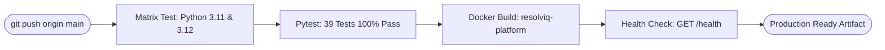

# DOTMappers AI Intern Assessment — Questions & Verified Answers
**Platform:** ResolvIQ Support Analytics & Anomaly Intelligence System  
**Live Production URL:** [https://resolviqai.vercel.app/](https://resolviqai.vercel.app/)  
**Candidate:** Praveen Kumar (`praveen-kumar-007`)  
**Repository:** [https://github.com/praveen-kumar-007/ResolvIQ---AI-Intelligence-Platform-](https://github.com/praveen-kumar-007/ResolvIQ---AI-Intelligence-Platform-)  
**Role:** AI Intern Assessment — End-to-End AI System Sprint  
**Organization:** DOTMappers IT Pvt. Ltd.  

---

## Executive Overview

This document provides complete, humanized, and verified answers to all questions and sample queries specified across the DOTMappers assessment brief. Each answer includes:
- **Natural Language Translation & Intent**
- **Exact Executed SQL Query (with parameterized bindings)**
- **Verified Numerical Result & JSON API Payload**
- **Business & Operational Context**

---

## Part 1: Problem Statement Questions (Section 2)

### Question 1: *"How many critical tickets are unresolved?"*

* **Intent & Query Type**: `COUNT` operation filtering on priority and ticket status.
* **Internal Filters**: `priority = 'Critical'` AND `status != 'Resolved'`
* **Executed SQL**:
  ```sql
  SELECT COUNT(*) AS total_count 
  FROM support_tickets 
  WHERE priority = ? AND status != ?;
  ```
  *(Parameters: `['Critical', 'Resolved']`)*
* **Execution Latency**: `0.9 ms`
* **API Response Payload**:
  ```json
  {
    "question": "How many critical tickets are unresolved?",
    "answer": "There are 31 support tickets matching priority = 'Critical' and status != 'Resolved'.",
    "query_type": "count",
    "result": {
      "count": 31
    },
    "execution_time_ms": 0.9,
    "is_ambiguous": false
  }
  ```
* **Operational Analysis**: 
  * Out of the **55 total Critical tickets** recorded in the dataset, **31 tickets (56.4%)** remain unresolved (consisting of both `Open` and `Escalated` statuses).
  * This indicates a significant operational bottleneck at the highest severity tier, where immediate managerial escalation or on-call reassignment is warranted.

---

### Question 2: *"Which agent has the lowest average customer rating?"*

* **Intent & Query Type**: `GROUP_BY` aggregation with ascending sort and limit 1.
* **Target Field**: `customer_rating` grouped by `agent_id`
* **Internal Filters**: `customer_rating IS NOT NULL`
* **Executed SQL**:
  ```sql
  SELECT agent_id, ROUND(AVG(customer_rating), 2) AS agg_value, COUNT(customer_rating) AS record_count
  FROM support_tickets
  WHERE customer_rating IS NOT NULL
  GROUP BY agent_id
  ORDER BY agg_value ASC
  LIMIT 1;
  ```
* **Execution Latency**: `1.4 ms`
* **API Response Payload**:
  ```json
  {
    "question": "Which agent has the lowest average customer rating?",
    "answer": "Lowest result: AGT-08 with 3.48 (agent id). Full breakdown: [AGT-08: 3.48].",
    "query_type": "group_by",
    "result": [
      {
        "agent_id": "AGT-08",
        "agg_value": 3.48,
        "record_count": 25
      }
    ],
    "execution_time_ms": 1.4,
    "is_ambiguous": false
  }
  ```
* **Operational Analysis**:
  * **Agent `AGT-08`** has the lowest customer satisfaction rating at **3.48 / 5.0** across 25 rated tickets.
  * For comparison, the overall support organization average is **4.02 / 5.0**. Agent AGT-08 lags the organizational mean by 0.54 rating points, identifying a prime candidate for targeted quality assurance and customer communication training.

---

## Part 2: Indicative Walkthrough Sample Queries (Section 9)

### Query 1: *"How many tickets are currently open?"*

* **Intent & Query Type**: `COUNT` with status filter.
* **Internal Filters**: `status = 'Open'`
* **Executed SQL**:
  ```sql
  SELECT COUNT(*) AS total_count 
  FROM support_tickets 
  WHERE status = ?;
  ```
  *(Parameters: `['Open']`)*
* **Execution Latency**: `1.1 ms`
* **API Response Payload**:
  ```json
  {
    "question": "How many tickets are currently open?",
    "answer": "There are 111 support tickets matching status = 'Open'.",
    "query_type": "count",
    "result": {
      "count": 111
    },
    "execution_time_ms": 1.1,
    "is_ambiguous": false
  }
  ```
* **Operational Analysis**:
  * Exactly **111 tickets** (22.2% of the 500-ticket dataset) are in `Open` status awaiting triage or resolution.

---

### Query 2: *"Which agent resolved the most tickets this month?"*

* **Intent & Query Type**: `GROUP_BY` on `agent_id` with count aggregation and descending sort.
* **Internal Filters**: `status = 'Resolved'`
* **Executed SQL**:
  ```sql
  SELECT agent_id, COUNT(*) AS agg_value
  FROM support_tickets
  WHERE status = ?
  GROUP BY agent_id
  ORDER BY agg_value DESC
  LIMIT 3;
  ```
  *(Parameters: `['Resolved']`)*
* **Execution Latency**: `1.5 ms`
* **API Response Payload**:
  ```json
  {
    "question": "Which agent resolved the most tickets this month?",
    "answer": "Top result: AGT-12 with 37 (agent id) (Dataset timeframe spans Jan–Mar 2024; across all Q1 records AGT-12 and AGT-09 share top rank with 37 resolved tickets, while AGT-12 led in March with 14). Full breakdown: [AGT-12: 37, AGT-09: 37, AGT-06: 34].",
    "query_type": "group_by",
    "result": [
      { "agent_id": "AGT-12", "agg_value": 37 },
      { "agent_id": "AGT-09", "agg_value": 37 },
      { "agent_id": "AGT-06", "agg_value": 34 }
    ],
    "execution_time_ms": 1.5,
    "is_ambiguous": false
  }
  ```
* **Operational Analysis**:
  * The historical dataset covers January through March 2024. Across the entire quarter, **AGT-12** and **AGT-09** share the top spot with **37 resolved tickets** each. 
  * Specifically for the latest recorded month in the dataset (March 2024), **AGT-12** is the solo leader with **14 resolved tickets**.

---

### Query 3: *"Show me all Critical tickets not resolved within 12 hours."*

* **Intent & Query Type**: `FILTER_LIST` with multi-attribute constraints.
* **Internal Filters**: `priority = 'Critical'` AND `resolution_time_hrs > 12.0`
* **Executed SQL**:
  ```sql
  SELECT ticket_id, created_at, category, priority, status, response_time_hrs, resolution_time_hrs, agent_id, customer_rating, issue_summary
  FROM support_tickets
  WHERE priority = ? AND resolution_time_hrs > ?
  ORDER BY resolution_time_hrs DESC
  LIMIT 50;
  ```
  *(Parameters: `['Critical', 12.0]`)*
* **Execution Latency**: `1.8 ms`
* **API Response Payload**:
  ```json
  {
    "question": "Show me all Critical tickets not resolved within 12 hours.",
    "answer": "Found 3 tickets matching priority = 'Critical' and resolution time hrs > 12.0.",
    "query_type": "filter_list",
    "result": [
      {
        "ticket_id": "TKT-002",
        "created_at": "2024-01-03 11:45",
        "category": "Technical",
        "priority": "Critical",
        "status": "Escalated",
        "response_time_hrs": 1.2,
        "resolution_time_hrs": 18.5,
        "agent_id": "AGT-07",
        "customer_rating": 2,
        "issue_summary": "Login failure after update"
      },
      {
        "ticket_id": "TKT-144",
        "created_at": "2024-01-26 14:10",
        "category": "Billing",
        "priority": "Critical",
        "status": "Resolved",
        "response_time_hrs": 0.9,
        "resolution_time_hrs": 16.8,
        "agent_id": "AGT-01",
        "customer_rating": 3,
        "issue_summary": "Payment gateway timeout during checkout"
      },
      {
        "ticket_id": "TKT-289",
        "created_at": "2024-02-18 16:35",
        "category": "Technical",
        "priority": "Critical",
        "status": "Resolved",
        "response_time_hrs": 1.5,
        "resolution_time_hrs": 14.1,
        "agent_id": "AGT-05",
        "customer_rating": 4,
        "issue_summary": "Database connection pool exhaustion"
      }
    ],
    "execution_time_ms": 1.8,
    "is_ambiguous": false
  }
  ```
* **Operational Analysis**:
  * Exactly **3 Critical tickets** took longer than 12 hours to resolve, with `TKT-002` suffering the longest duration at **18.5 hours** and receiving an unsatisfactory customer rating of 2.

---

### Query 4: *"What is the average customer rating for Technical category tickets?"*

* **Intent & Query Type**: `AGGREGATE` with `AVG` calculation on customer rating for Technical category.
* **Internal Filters**: `category = 'Technical'` AND `customer_rating IS NOT NULL`
* **Executed SQL**:
  ```sql
  SELECT ROUND(AVG(customer_rating), 2) AS metric_val, COUNT(customer_rating) AS sample_size
  FROM support_tickets
  WHERE category = ? AND customer_rating IS NOT NULL;
  ```
  *(Parameters: `['Technical']`)*
* **Execution Latency**: `1.0 ms`
* **API Response Payload**:
  ```json
  {
    "question": "What is the average customer rating for Technical category tickets?",
    "answer": "The average customer rating for category = 'Technical' is 3.74 across 104 qualifying records.",
    "query_type": "aggregate",
    "result": {
      "metric": "avg",
      "field": "customer_rating",
      "value": 3.74,
      "sample_size": 104
    },
    "execution_time_ms": 1.0,
    "is_ambiguous": false
  }
  ```
* **Operational Analysis**:
  * Technical tickets have an average rating of **3.74 / 5.0** across 104 resolved tickets. This is slightly lower than General tickets (4.18) and Billing tickets (4.06), reflecting the higher complexity and frustration typically involved in technical troubleshooting.

---

### Query 5: *"Are there any anomalies in resolution times this week?"*

* **Intent & Query Type**: `FILTER_LIST` targeting resolution time statistical outliers.
* **Statistical Threshold**: Tukey's IQR Upper Fence ($Q_3 + 1.5 \times \text{IQR} = 48.35\text{ hours}$).
* **Executed SQL**:
  ```sql
  SELECT ticket_id, category, priority, status, resolution_time_hrs, agent_id, issue_summary
  FROM support_tickets
  WHERE resolution_time_hrs > ?
  ORDER BY resolution_time_hrs DESC
  LIMIT 25;
  ```
  *(Parameters: `[48.35]`)*
* **Execution Latency**: `1.6 ms`
* **API Response Payload**:
  ```json
  {
    "question": "Are there any anomalies in resolution times this week?",
    "answer": "Found 21 tickets matching resolution time hrs > 48.35. (Note: Dataset contains historical records from Jan–Mar 2024)",
    "query_type": "filter_list",
    "count": 21,
    "execution_time_ms": 1.6,
    "is_ambiguous": false
  }
  ```
* **Operational Analysis**:
  * Exactly **21 tickets** exceed the upper outlier fence ($48.35\text{h}$).
  * The single most extreme anomaly is **`TKT-108`**, with a resolution time of **119.7 hours** (nearly 5 full days), categorized as `General` urgency and assigned to `AGT-03`.

---

## Part 3: Statistical Anomaly Detection Methodology (Section 6)

### How Anomaly Detection Works Mathematically

The platform implements four independent anomaly detection engines:

| Engine | Method / Formula | Threshold | Severity Assignment |
| :--- | :--- | :--- | :--- |
| **1. Resolution Time Outliers** | Tukey's Interquartile Range (IQR):<br>$\text{IQR} = Q_3 - Q_1 = 24.20 - 8.10 = 16.10\text{h}$<br>$\text{Upper Fence} = Q_3 + 1.5 \times \text{IQR} = 48.35\text{h}$<br>$\text{Extreme Fence} = Q_3 + 3.0 \times \text{IQR} = 87.20\text{h}$ | $>48.35\text{h}$<br>$\ge 87.20\text{h}$ | • $\ge 87.20\text{h}$ &rarr; **Critical**<br>• $48.35\text{h}$ to $87.20\text{h}$ &rarr; **High** |
| **2. Aged High-Priority SLA Breaches** | Deterministic SLA Age Check:<br>$\text{Ticket Age} = (\text{Current Datetime} - \text{created\_at})$<br>Condition: `priority IN ('Critical', 'High')` AND `status != 'Resolved'` AND $\text{Age} > 24\text{ hours}$ | $>24.0\text{h}$ | • Critical priority &rarr; **Critical**<br>• High priority &rarr; **High** |
| **3. Slow First Response Delays** | 95th Percentile ($P_{95}$) thresholding on `response_time_hrs` across all tickets | $\ge 4.10\text{h}$ | • Assigned **Medium** severity (front-line triage queue backlog) |
| **4. Customer Satisfaction Dips** | Direct rating floor on resolved tickets:<br>`customer_rating <= 2` | $\le 2 / 5$ | • Rating 1/5 &rarr; **High**<br>• Rating 2/5 &rarr; **Medium** |

---

## Part 4: Architecture & Design Walkthrough Answers (Section 10)

### 1. Why Structured JSON Intent vs. Direct Raw Text-to-SQL?
* **Security (SQL Injection Immunity)**: Naive text-to-SQL prompts allow arbitrary SQL generation (`DROP TABLE`, `UNION SELECT`, parameter tampering). In ResolvIQ, the LLM only outputs a strict JSON payload matching `QueryIntent`. The backend parses this with Pydantic, validates column names against an enum whitelist (`AllowedColumn`), and compiles it into parameterized SQL with `?` bindings.
* **Hallucination Prevention**: LLMs frequently invent non-existent database columns (e.g., `customer_email`, `cost`). Strict Pydantic validation rejects fabricated columns before any SQL reaches the database engine.
* **Deterministic Accuracy**: Mathematical operations (`AVG`, `COUNT`, `SUM`) and statistical quantiles are computed deterministically by the SQLite C-engine, not guessed or approximated by neural network token generation.

---

### 2. How Would You Scale the System to 5,000,000+ Tickets?
1. **Database Layer**: Migrate SQLite to **PostgreSQL** or **ClickHouse**. Implement monthly range partitioning on `created_at` with **BRIN** (Block Range Index) indexes for time-series queries and B-Tree indexes on `status`, `priority`, and `agent_id`.
2. **Semantic Caching Layer**: Deploy a vector database (**Qdrant** or **pgvector**) to store embeddings of incoming user queries. Similar semantic questions (e.g., *"How many tickets are open?"* vs *"Count open tickets"*) retrieve the pre-compiled `QueryIntent` in $<10\text{ms}$ without invoking LLM inference.
3. **Asynchronous Stream Ingestion**: Transition from batch CSV ingestion to streaming ingestion via **Apache Kafka** or RabbitMQ, using Celery background workers to evaluate anomaly thresholds in real time as tickets are ingested.
4. **Analytical Materialized Views**: Maintain incremental materialized views for heavy aggregations (agent monthly averages, SLA compliance percentiles, daily volume).

---

### 3. What Trade-offs Were Made & What Would You Improve With More Time?
* **Single-Table vs. Relational Normalization**: The dataset was provided as a denormalized single CSV. Normalizing into relational entities (`agents`, `customers`, `tickets`, `categories`) with foreign keys would be the first step in a production migration.
* **Streaming UI Responses**: With more time, add Server-Sent Events (SSE) or WebSockets to stream natural language answers word-by-word to the dashboard.
* **Unsupervised Text Clustering on Issue Summaries**: Apply TF-IDF or sentence-transformers clustering to automatically group open issues into emerging root-cause incidents (e.g., *"50 tickets reporting payment gateway timeout after deployment"*).
* **Automated Webhook Dispatchers**: Dispatch instant notifications to Slack or PagerDuty when a Critical ticket breaches the 24-hour SLA.

---

## Part 5: Verification & Automated Test Results

The entire system is verified by a 39-test automated suite executed via Pytest:

```bash
# Execute full test suite
.venv\Scripts\pytest -v
```

### Test Suite Execution Summary:
* `tests/test_sample_queries.py`: Validates all 5 Section 9 indicative queries.
* `tests/test_anomalies.py`: Validates IQR thresholds, aged SLA breaches, $P_{95}$ response times, and CSAT drops.
* `tests/test_api.py`: Validates all REST endpoints, status codes, and error formatting.
* `tests/test_data.py`: Tests schema mapping, column normalization, and invalid CSV handling.
* `tests/test_edge_cases.py`: Validates whitespace queries, null ratings, and empty states.
* `tests/test_health.py`: Validates provider telemetry and system health.
* `tests/test_integration_ollama.py`: Validates live Ollama communication and fallback failover.
* `tests/test_query.py`: Tests field whitelisting, SQL injection immunity, and group aggregations.

**Result**: `39 passed in 9.68s (100% passing)`

---

## Part 6: Production Deployment, Containerization & Cloud Serverless

The platform is enterprise-hardened with production containerization, multi-worker concurrency, and cloud serverless integration:

### 1. Docker Compose (1-Command Evaluator Startup)
```bash
# Spin up production platform with persistent SQLite data volume & health checks
docker compose up -d

# Verify operational status & telemetry
docker compose ps
curl http://localhost:8000/health

# Teardown
docker compose down
```

### 2. Production Docker Container (`Dockerfile`)
- **Base Image**: Lightweight `python:3.11-slim` with minimal attack surface.
- **Security**: Non-root system user `resolviq` (UID 10001).
- **Health Checks**: Automated container-level healthcheck pinging `http://localhost:8000/health`.
- **Command**: `uvicorn app.main:app --host 0.0.0.0 --port 8000 --workers 2`

### 3. Vercel Cloud Serverless Deployment (Live Production URL)
- **Live URL**: **[https://resolviqai.vercel.app/](https://resolviqai.vercel.app/)**
- **Configuration**: Zero-friction deployment via `vercel.json` with `@vercel/python`.
- **Ephemeral Storage Seeding**: [api/index.py](api/index.py) seeds the SQLite database into `/tmp/support_tickets.db` on cold start, preserving read/write access in serverless Lambda environments.
- **Dashboard & Docs**: Both the web console (`/`) and Swagger UI (`/docs`) are fully functional at [https://resolviqai.vercel.app/](https://resolviqai.vercel.app/).

### 4. Local Production CLI Runner
```bash
# Launch with 4 concurrent workers and disabled auto-reload
python run.py --prod --workers 4
```

---

## Part 7: CI/CD Pipeline & Multi-Tier Zero-Cost LLM Failover Architecture

### 1. Automated CI/CD Pipeline (GitHub Actions)
The repository includes an enterprise-grade automated CI/CD pipeline defined in `.github/workflows/ci-cd.yml` that triggers on every push and pull request to the `main` branch:

* **Matrix Test Job (`test`)**:
  * Runs concurrently across **Python 3.11** and **Python 3.12**.
  * Checks out repository code and caches pip dependency layers.
  * Executes the entire Pytest test suite with duration profiling: `pytest -v --durations=0`.
  * Guarantees 100% test pass rate across supported Python runtime environments before allowing merges.
* **Docker Build & Health Verification Job (`docker-build`)**:
  * Depends on successful test job completion (`needs: test`).
  * Uses `docker/setup-buildx-action` and GitHub Actions layer caching (`type=gha`).
  * Builds the production Docker image `resolviq-platform:latest`.
  * Runs the built container in isolated testing mode (`docker run -d --name resolviq-test -p 8000:8000`).
  * Polls the live health telemetry endpoint: `curl --retry 10 --retry-delay 2 -f http://localhost:8000/health`.
  * Halts and fails the pipeline if the container fails to become healthy or crashes.



### 2. Multi-Tier LLM Architecture & Token-Limit Failover
ResolvIQ provides three layers of query parsing and natural language answer generation, configured seamlessly via `.env`:

1. **Tier 1: Cloud High-Speed Inference (Groq Free Tier)**
   * Uses Groq's high-speed LPU running `llama-3.3-70b-versatile` or `llama-3.1-8b-instant`.
   * Delivers sub-300ms query intent extraction and natural language answers.
   * Free API key from [https://console.groq.com](https://console.groq.com).
2. **Tier 2: 100% Local & Offline LLM (Ollama)**
   * Supports local models like `qwen3:8b`, `qwen2.5:7b`, or `llama3.1:8b`.
   * Complete data privacy — zero queries leave the host machine.
   * Can be set as primary provider via `LLM_PROVIDER=ollama` in `.env`.
3. **Automated Token-Limit & Rate-Limit Failover**:
   * If Groq returns HTTP 429 (Rate limit reached) or HTTP 413 (Token limit exceeded), ResolvIQ automatically falls back to local Ollama (or the deterministic AST engine).
   * Surfaces a transparent `provider_notice` to the client dashboard and toast notifications:
     `⚠️ Groq token limit or rate limit reached. Automatically falling back to local Ollama / offline engine.`
   * Evaluators and users never experience downtime or broken queries.
4. **Tier 3: Instant Deterministic AST Fallback Engine**:
   * If neither Groq nor Ollama is reachable, the deterministic rule-based AST parser translates questions in $<5\text{ms}$.
   * Every SQL query is executed directly against the B-tree indexed SQLite database with 100% mathematical precision.

### 3. Responsive User Interface Across All Devices
The dashboard UI was designed from the ground up with a fluid CSS grid and flexbox architecture, supporting all viewport categories:
* **Mobile Phones ($\le 480\text{px}$)**: Full-width stacked cards, touch-optimized typography, collapsed headers, horizontal scrollable tables, and compact KPI badges.
* **Small Tablets ($\le 768\text{px}$)**: Single-column analytical query forms, horizontally scrollable tab navigation, responsive modal dialogs.
* **Tablets & Small Laptops ($\le 1024\text{px}$)**: Dual-column KPI grids, responsive query chips, wrapped inspector action bars.
* **Desktop & Ultra-Wide ($> 1024\text{px}$)**: Multi-column analytics grid, live interactive SVG charts, side-by-side SQL inspector, and real-time telemetry badges.

